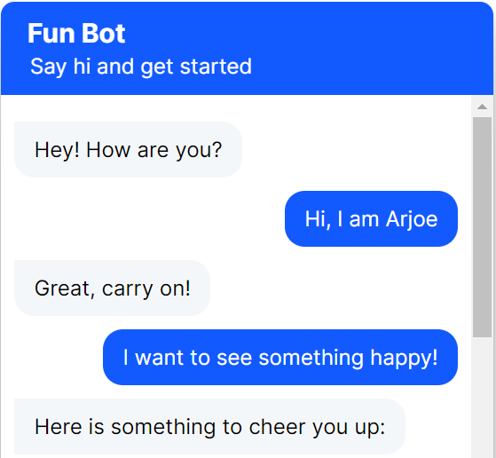

# bot4fun
An Open-Source Question-Answer Chatbot Framework for Interactive and Informative Conversations.

## Setup steps
1. Install VS Code
2. Install Python
3. Install Python extension
4. Install Git
5. Initialise a project in Github and clone in local
6. Create and activate virtual environment (.venv)
7. Install rasa (Optional : create requirements.txt)
8. Run rasa init to create a project
9. Uncomment socketio in credentials.yml and update the entries
10. Add index.html (refer: https://github.com/botfront/rasa-webchat)
11. Run command - `rasa run -m models --enable-api --cors "*"`
12. In browser, paste complete path to index.html and go.

